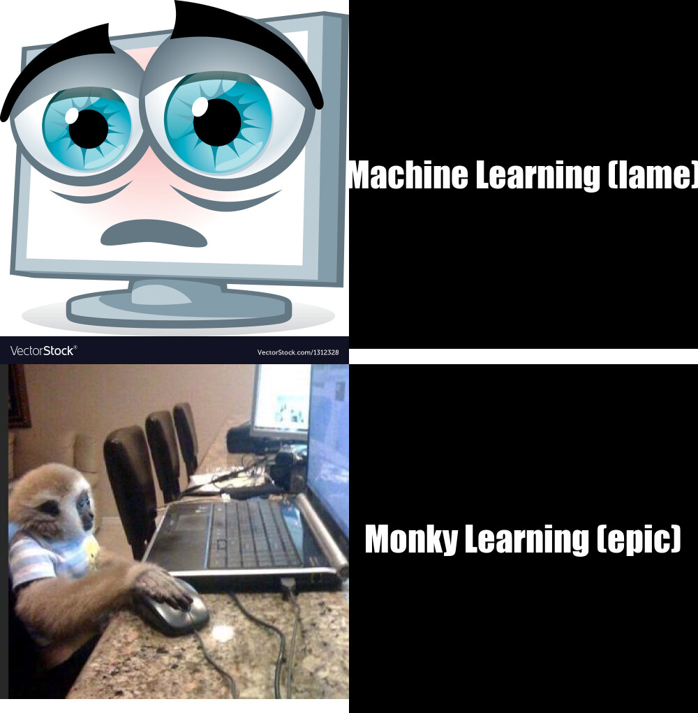

# Welcome to my website
 It's **super epic**

Check out my meme
## Super funny meme below:


Facts about my meme 
* Classic meme format
* Inspired by monky meme trend
* Used R code you can find below!

## Here is the R code I used to create my super funny meme
```r
library(magick)
sad_computer <- image_read("https://cdn4.vectorstock.com/i/1000x1000/23/28/pc-sad-vector-1312328.jpg")%>%
  image_scale(500)

monky <- image_read("https://answeritsa.files.wordpress.com/2013/06/monkey-computer-user.jpg")%>%
  image_scale(500)

computer_text <- image_blank(width = 500, height = 500, color = "#000000")%>%
  image_annotate(text="Machine Learning (lame)", color = "#FFFFFF", size = 50, font = "Impact", gravity = "center")

monky_text <- image_blank( width = 500, height = 500, color = "#000000")%>%
  image_annotate(text = "Monky Learning (epic)", color = "#FFFFFF",size = 50, font = "Impact", gravity = "center")

first_row <- c(sad_computer, computer_text)%>%
  image_append 

second_row <- c(monky, monky_text)%>%
  image_append

meme_ag <-c(first_row, second_row)%>%
  image_append(stack = TRUE)

meme_ag
```
